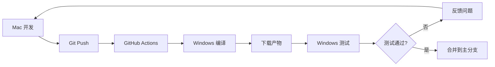

# Windows 版本测试指南

## 环境要求

### 必需软件
1. **Sandboxie-Plus** (免费开源)
   - 下载地址: https://sandboxie-plus.com/downloads/
   - 安装到默认路径: `C:\Program Files\Sandboxie-Plus\`
   - 版本要求: 1.0.0 或更高

2. **企业微信**
   - 下载地址: https://work.weixin.qq.com/
   - 安装路径: `C:\Program Files (x86)\WXWork\WXWork.exe` (默认)

3. **Rust 工具链** (如果需要本地编译)
   - 下载地址: https://www.rust-lang.org/tools/install
   - 使用 `rustup-init.exe` 安装

## 测试方式 1: 使用 GitHub Actions 编译

### 步骤 1: 推送代码触发编译

```bash
# 在当前分支推送代码
git push origin feature/windows-support
```

### 步骤 2: 查看 GitHub Actions 状态

1. 访问仓库的 Actions 页面
2. 查看 "Build Windows Release" 工作流
3. 等待编译完成(约 5-10 分钟)

### 步骤 3: 下载编译产物

编译成功后,可以在以下位置下载:

1. **Actions 页面** > 选择最新的成功构建 > 下载 Artifacts
   - `wecom-multi-open-windows-msi` - MSI 安装包
   - `wecom-multi-open-windows-exe` - 可执行文件

2. **Releases 页面** (如果推送了 tag)
   ```bash
   git tag v0.3.0-windows-alpha
   git push origin v0.3.0-windows-alpha
   ```

### 步骤 4: 在 Windows 机器上测试

1. 下载 `.exe` 或 `.msi` 文件
2. 确保已安装 Sandboxie-Plus
3. 确保已安装企业微信
4. 运行程序
5. 在 GUI 中点击"启动实例"

## 测试方式 2: 本地编译 (需要 Windows 环境)

如果你有 Windows 开发环境:

```powershell
# 1. 克隆仓库
git clone <your-repo-url>
cd mutil_wechat
git checkout feature/windows-support

# 2. 安装依赖
# (确保已安装 Rust 和 Node.js)

# 3. 编译
cargo build --release

# 4. 运行
.\target\release\wecom-multi-open.exe
```

## 测试方式 3: 使用远程 Windows 服务器

如果使用云服务器或虚拟机:

1. 设置 Windows Server (Azure / AWS / 阿里云)
2. 通过 RDP 连接
3. 按照"测试方式 2"的步骤操作

## 预期测试结果

### 成功标志
- ✅ 程序启动无错误
- ✅ 能够检测到 Sandboxie-Plus 安装
- ✅ 能够检测到企业微信安装路径
- ✅ 能够创建沙盒 (查看 Sandboxie Control)
- ✅ 能够在沙盒中启动企业微信
- ✅ 多个实例可以同时运行
- ✅ 每个实例可以登录不同账号
- ✅ 账号互不干扰(A 登录不会导致 B 登出)
- ✅ 沙盒有不同颜色边框(红、绿、蓝等)

### 常见问题排查

#### 1. "未找到 Sandboxie-Plus 安装"
```
错误: Sandboxie-Plus 未安装
解决:
- 确认已安装 Sandboxie-Plus
- 确认安装路径为 C:\Program Files\Sandboxie-Plus\
- 检查 SbieIni.exe 和 Start.exe 是否存在
```

#### 2. "未找到企业微信安装路径"
```
错误: 未找到企业微信安装路径
解决:
- 确认已安装企业微信
- 检查以下路径是否存在:
  C:\Program Files (x86)\WXWork\WXWork.exe
  C:\Program Files\WXWork\WXWork.exe
```

#### 3. "沙盒创建失败"
```
错误: SbieIni 命令失败
解决:
- 以管理员身份运行程序
- 检查 Sandboxie 服务是否运行
- 查看 Sandboxie Control 是否有错误提示
```

#### 4. "启动失败"
```
错误: 启动程序失败
解决:
- 检查企业微信路径是否正确
- 尝试手动启动: Start.exe /box:WeCom_1 "C:\Program Files\WXWork\WXWork.exe"
- 查看 Sandboxie 日志
```

## 测试检查清单

在 Windows 机器上测试时,请检查以下项目:

- [ ] Sandboxie-Plus 已安装并运行
- [ ] 企业微信已安装
- [ ] 程序能够启动
- [ ] 能够创建沙盒
- [ ] 能够启动单个实例
- [ ] 能够启动多个实例(3-5个)
- [ ] 实例间互不干扰
- [ ] 每个实例可以登录不同账号
- [ ] 实例显示不同颜色边框
- [ ] 能够正常关闭实例
- [ ] 能够清理沙盒
- [ ] 程序退出时自动清理

## 性能测试

测试不同数量的实例:

| 实例数 | 预计内存占用 | 预计启动时间 | 建议配置 |
|--------|-------------|-------------|---------|
| 2      | ~1.5 GB     | 10秒        | 4GB RAM |
| 3      | ~2.2 GB     | 15秒        | 8GB RAM |
| 5      | ~3.5 GB     | 25秒        | 8GB RAM |
| 10     | ~7 GB       | 50秒        | 16GB RAM|

## 反馈问题

如果遇到问题,请收集以下信息:

1. **系统信息**
   - Windows 版本 (运行 `winver`)
   - 系统架构 (32位/64位)
   - 可用内存

2. **软件版本**
   - Sandboxie-Plus 版本
   - 企业微信版本
   - 程序版本 (从 About 或 --version)

3. **错误信息**
   - 完整的错误消息
   - 程序日志
   - Sandboxie 日志 (在 Sandboxie Control 中)

4. **复现步骤**
   - 详细描述操作步骤
   - 截图或录屏

## 下一步开发

测试成功后,可以考虑:

1. 优化实例间启动延迟
2. 添加系统托盘图标
3. 添加自动更新功能
4. 优化沙盒配置
5. 添加实例命名功能
6. 实现实例持久化

## 开发流程



## 许可证和依赖

- **Sandboxie-Plus**: GPL-3.0 License
- **项目依赖**: 见 Cargo.toml
- **使用限制**: 仅供合法合规使用
