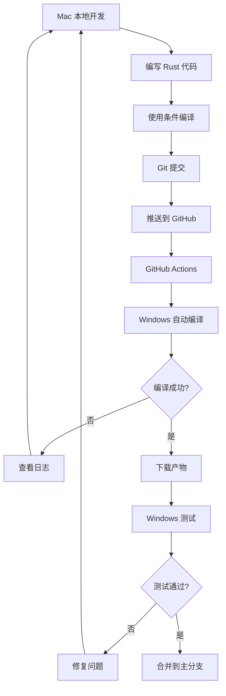

# 如何使用 GitHub Actions 编译 Windows 版本

## 当前状态

✅ 已完成的工作:
- Windows 平台代码实现 (Sandboxie 集成)
- GitHub Actions 自动编译配置
- 完整的测试文档和用户指南
- 条件编译确保不影响 macOS 版本

🎯 当前分支: `feature/windows-support`

## 一键推送并编译

### 步骤 1: 推送到 GitHub

```bash
# 确保所有更改已提交
git status

# 推送当前分支到 GitHub
git push origin feature/windows-support
```

### 步骤 2: 查看编译状态

1. 打开浏览器访问你的 GitHub 仓库
2. 点击顶部的 **"Actions"** 标签
3. 查看 **"Build Windows Release"** 工作流
4. 等待编译完成 (约 5-10 分钟)

编译过程:
```
正在运行...
├─ Checkout repository
├─ Setup Node.js
├─ Install Rust stable
├─ Rust cache
├─ Install frontend dependencies (npm install)
├─ Build Tauri app (npm run tauri build)
└─ Upload artifacts
```

### 步骤 3: 下载编译产物

编译成功后:

1. 进入该次运行详情页
2. 滚动到底部 **"Artifacts"** 区域
3. 下载以下文件:
   - `wecom-multi-open-windows-msi` - 安装包
   - `wecom-multi-open-windows-exe` - 可执行文件

### 步骤 4: 在 Windows 机器上测试

1. 将下载的文件传输到 Windows 机器
2. 确保已安装:
   - Sandboxie-Plus
   - 企业微信
3. 运行程序并测试功能

## 创建 Release (可选)

如果测试成功,想创建正式版本:

```bash
# 创建 tag
git tag v0.3.0-windows-alpha -m "Windows Alpha 版本"

# 推送 tag
git push origin v0.3.0-windows-alpha
```

GitHub Actions 会自动:
1. 编译 Windows 版本
2. 创建 GitHub Release
3. 上传编译产物到 Release

用户可以直接从 Releases 页面下载。

## 工作流文件说明

配置文件: `.github/workflows/build-windows.yml`

**触发条件**:
- 推送到 `main` 或 `develop` 分支
- 推送 `v*` 格式的 tag
- Pull Request 到 `main` 分支
- 手动触发 (workflow_dispatch)

**编译环境**:
- 运行器: `windows-latest` (GitHub 托管的 Windows Server)
- Node.js: 20
- Rust: stable (最新稳定版)

**产物**:
- MSI 安装包: `src-tauri/target/release/bundle/msi/*.msi`
- EXE 可执行文件: `src-tauri/target/release/*.exe`
- 保留期限: 30 天

## 本地查看编译日志

如果需要调试编译问题:

```bash
# 查看 Actions 日志 (需要 GitHub CLI)
gh run list
gh run view <run-id> --log
```

或直接在浏览器中查看详细日志。

## 常见编译问题

### 问题 1: npm install 失败

```
Error: Cannot find module 'xxx'
```

**解决**:
- 确保 `package.json` 中依赖版本正确
- 检查 `package-lock.json` 是否已提交

### 问题 2: Rust 编译错误

```
error[E0425]: cannot find value `xxx` in this scope
```

**解决**:
- 在 Mac 上使用 `cargo check` 检查语法
- 确保 Windows 特定代码在 `#[cfg(target_os = "windows")]` 内
- 检查导入和模块声明

### 问题 3: Tauri 构建失败

```
Error: Failed to build app
```

**解决**:
- 确保 `src-tauri/tauri.conf.json` 配置正确
- 检查 `src-tauri/Cargo.toml` 依赖版本
- 查看完整日志定位具体问题

## 开发工作流程

完整的跨平台开发流程:



## 成本说明

使用 GitHub Actions 是免费的 (在限额内):

- **公开仓库**: 完全免费,无限制
- **私有仓库**:
  - Free 账号: 2000 分钟/月
  - Pro 账号: 3000 分钟/月
  - Team 账号: 10000 分钟/月

每次编译约消耗:
- 5-10 分钟 (Windows 编译)

## 下一步

1. ✅ 推送代码到 GitHub
2. ⏳ 等待 Actions 编译完成
3. ⏳ 下载编译产物
4. ⏳ 在 Windows 机器上测试
5. ⏳ 根据测试结果调整代码
6. ⏳ 测试通过后合并到主分支

## 有用的命令

```bash
# 查看当前状态
git status
git log --oneline -5

# 查看所有分支
git branch -a

# 查看远程仓库
git remote -v

# 强制推送 (慎用)
git push origin feature/windows-support --force

# 查看 tag
git tag -l

# 删除 tag
git tag -d v0.3.0-windows-alpha
git push origin :refs/tags/v0.3.0-windows-alpha
```

## 联系和支持

如果遇到问题:

1. 查看 [Windows 测试指南](Windows测试指南.md)
2. 查看 [GitHub Actions 日志](https://docs.github.com/en/actions)
3. 提交 Issue 到 GitHub 仓库

---

**准备好了吗?** 运行 `git push origin feature/windows-support` 开始编译! 🚀
